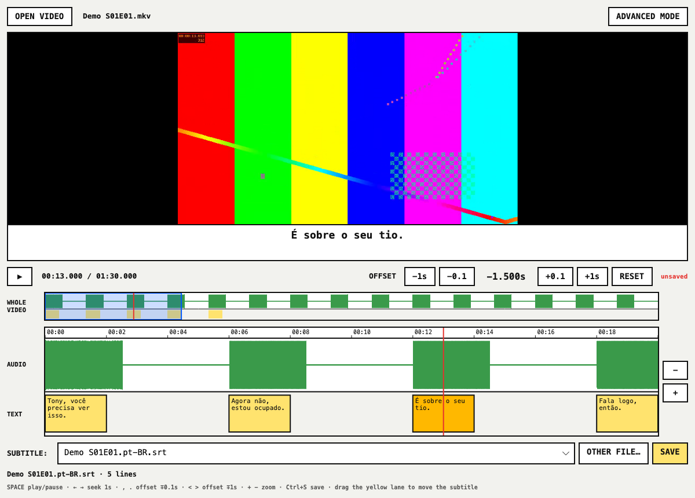
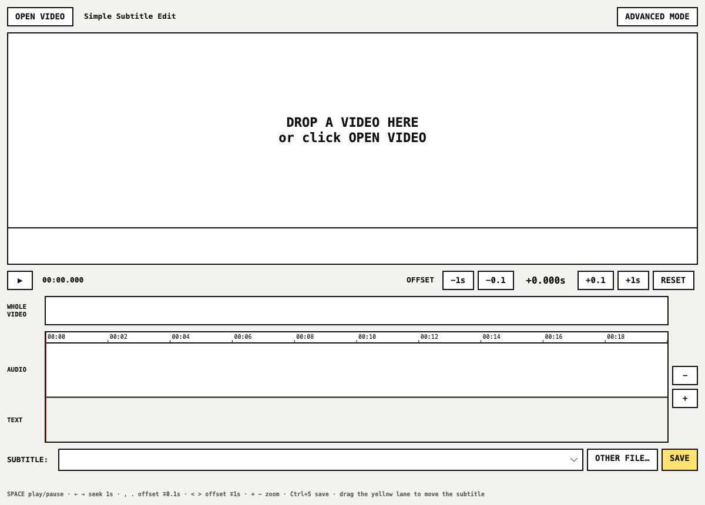
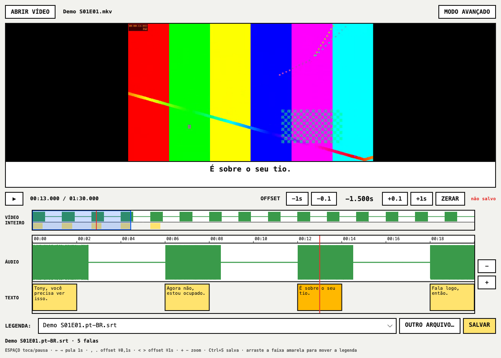

# Simple Subtitle Edit

Fix subtitles that are out of sync, without learning a subtitle editor.

Open a video, see where the speech is and where the subtitle lines are, slide the subtitle
until they match, and save. The fixed `.srt` goes next to the video with the video's name, so
Plex, VLC, mpv and smart TVs pick it up on their own.



[Leia em português](#português)

## What you see

| Part | What it does |
|---|---|
| **Video** | Plays any video ffmpeg/mpv can open: mkv, mp4, avi, HEVC 10-bit, AV1… The current subtitle line is shown under the picture. |
| **WHOLE VIDEO** | The entire video in one bar. Green is the audio, **yellow marks where there is subtitle text**. Gaps in yellow = parts with no subtitle. The blue box is the part shown below; click or drag to jump. |
| **AUDIO** | Zoomed waveform. Speech shows up as green blocks. |
| **TEXT** | Each subtitle line as a yellow block, under the audio it belongs to. When the blocks do not line up with the speech, the subtitle is out of sync. |
| **OFFSET** | Moves the whole subtitle earlier (−) or later (+). |
| **SUBTITLE** | Every subtitle found next to the video or inside it (mkv/mp4 text tracks). Pick another one to compare. |
| **SAVE** | Writes `video-name.srt` next to the video. If that file already exists, the old one is kept as `video-name.srt.bak`. |

## How to fix a subtitle in 4 steps

1. **Drag the video into the window** (or click **OPEN VIDEO**). The subtitles next to it are
   loaded; the one named like the video comes first.
2. **Find a line of speech** in the AUDIO lane and look at the yellow block under it.
   - Block starts **after** the speech → the subtitle is late → press **−0.1** / **−1s**.
   - Block starts **before** the speech → the subtitle is early → press **+0.1** / **+1s**.
   - Or just **drag the yellow lane** sideways until the blocks sit under the speech.
3. **Check another part of the video**: click further along the WHOLE VIDEO bar. If the
   blocks match at the start but drift apart near the end, this subtitle was made for a
   different cut or frame rate. Pick another one in **SUBTITLE**, or use
   **ADVANCED MODE → Synchronization → Change frame rate**.
4. **SAVE**.



## Keyboard

| Key | Action |
|---|---|
| `Space` | Play / pause |
| `←` `→` | Back / forward 1 second |
| `,` `.` | Offset −0.1 s / +0.1 s |
| `<` `>` (Shift + `,` `.`) | Offset −1 s / +1 s |
| `+` `−` | Zoom in / out |
| `Ctrl+S` / `Cmd+S` | Save |
| Mouse wheel on the timeline | Scroll; with `Ctrl`/`Cmd`, zoom |

## Install

> There are no ready-made downloads yet. Until there are, build it from source (below).

The app needs two free programs: **mpv** (plays the video) and **ffmpeg** (reads the audio).

| System | Install mpv and ffmpeg |
|---|---|
| **macOS** | `brew install mpv ffmpeg` ([Homebrew](https://brew.sh)) |
| **Ubuntu / Debian** | `sudo apt install libmpv2 ffmpeg` |
| **Fedora** | `sudo dnf install mpv-libs ffmpeg` |
| **Windows** | mpv: the app offers to download it on first start. ffmpeg: `winget install ffmpeg` |

### Build from source

Needs the [.NET 10 SDK](https://dotnet.microsoft.com/download).

```bash
git clone https://github.com/kevinkirsten/simple-subtitle-edit.git
cd simple-subtitle-edit
dotnet run --project src/ui/UI.csproj -c Release
```

Open a video directly: `dotnet run --project src/ui/UI.csproj -c Release -- "/path/to/video.mkv"`.

## Advanced mode

Everything from the original Subtitle Edit is still here: editing text, OCR of image
subtitles (PGS/VobSub), speech-to-text, translation, 300+ formats. Click **ADVANCED MODE** in
the window, or start the app with `--advanced`.

## For developers

```bash
dotnet test tests/libuilogic/LibUiLogicTests.csproj --filter "FullyQualifiedName~SimpleSync"   # unit tests
dotnet test tests/UI/UITests.csproj --filter "FullyQualifiedName~Features.Simple"            # end-to-end (headless)
./scripts/make-screenshots.sh                                                               # regenerate the README images
```

| Where | What |
|---|---|
| `src/libuilogic/SimpleSync/` | No UI: finding subtitles for a video, loading them, offset, coverage, saving |
| `src/ui/Features/Simple/` | The simple window, timeline, overview bar, waveform extraction |
| `src/ui/Program.cs` | Starts the simple window; `--advanced` starts the full editor |

The end-to-end tests drive a real window with real mouse and keyboard input through
Avalonia's headless platform; only the native video player is replaced by a fake.

## Credits and license

Simple Subtitle Edit is a fork of [Subtitle Edit](https://github.com/SubtitleEdit/subtitleedit)
by Nikolaj Olsson and contributors. The video player, waveform engine and subtitle formats
are theirs. MIT License, see [LICENSE](LICENSE). The original README is in
[README.upstream.md](README.upstream.md).

---

## Português

Conserta legenda fora de sincronia sem precisar aprender um editor de legendas.

Abra o vídeo, veja onde estão as falas e onde estão as legendas, arraste a legenda até
encaixar e salve. O `.srt` corrigido vai para a mesma pasta do vídeo, com o mesmo nome, e o
Plex, o VLC, o mpv e as TVs encontram sozinhos.



### Como usar

1. **Arraste o vídeo para a janela** (ou clique em **ABRIR VÍDEO**). As legendas da pasta e
   as que estão dentro do vídeo aparecem em **LEGENDA**; a com o nome do vídeo vem primeiro.
2. **Ache uma fala** na faixa ÁUDIO (os blocos verdes) e olhe o bloco amarelo embaixo dela.
   - Bloco começa **depois** da fala → legenda atrasada → **−0.1** / **−1s**.
   - Bloco começa **antes** da fala → legenda adiantada → **+0.1** / **+1s**.
   - Ou **arraste a faixa amarela** para o lado até encaixar.
3. **Confira outro trecho**: clique mais adiante na barra VÍDEO INTEIRO. Os trechos sem
   amarelo são partes sem legenda. Se no começo encaixa e no fim desencaixa, a legenda é de
   outra versão do vídeo: escolha outra em **LEGENDA**.
4. **SALVAR**. Se já existir um `.srt` com o nome do vídeo, o antigo vira `.srt.bak`.

| Tecla | Ação |
|---|---|
| `Espaço` | Toca / pausa |
| `←` `→` | Volta / avança 1 s |
| `,` `.` | Offset −0,1 s / +0,1 s |
| `<` `>` | Offset −1 s / +1 s |
| `+` `−` | Zoom |
| `Ctrl+S` / `Cmd+S` | Salvar |

### Instalar

Ainda não há instalador pronto. Por enquanto, instale o **mpv** e o **ffmpeg** (tabela em
[Install](#install)), o [.NET 10 SDK](https://dotnet.microsoft.com/download) e rode:

```bash
git clone https://github.com/kevinkirsten/simple-subtitle-edit.git
cd simple-subtitle-edit
dotnet run --project src/ui/UI.csproj -c Release
```

A interface aparece em português quando o sistema está em português.
