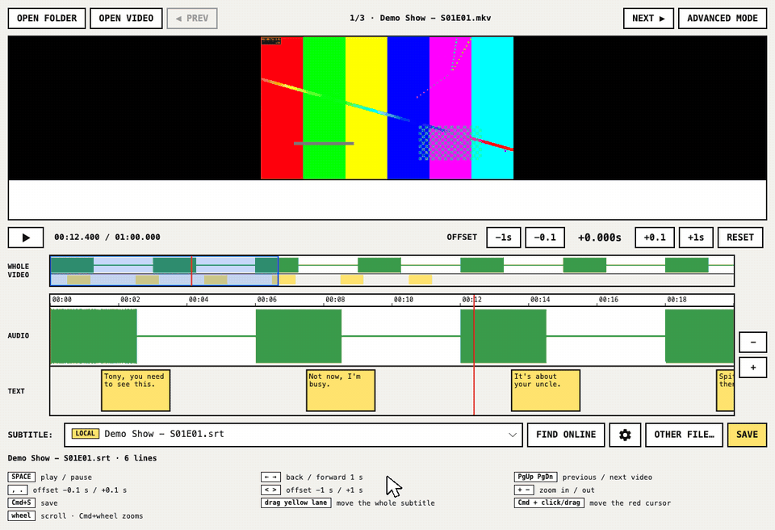
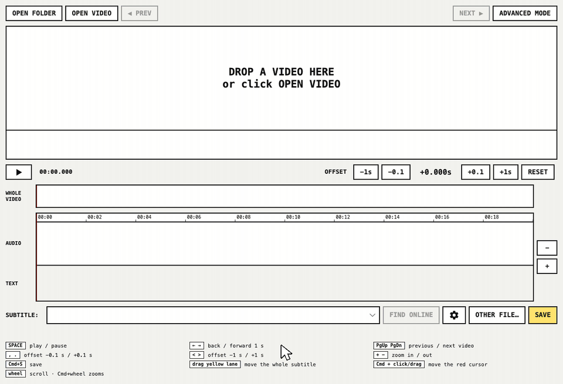
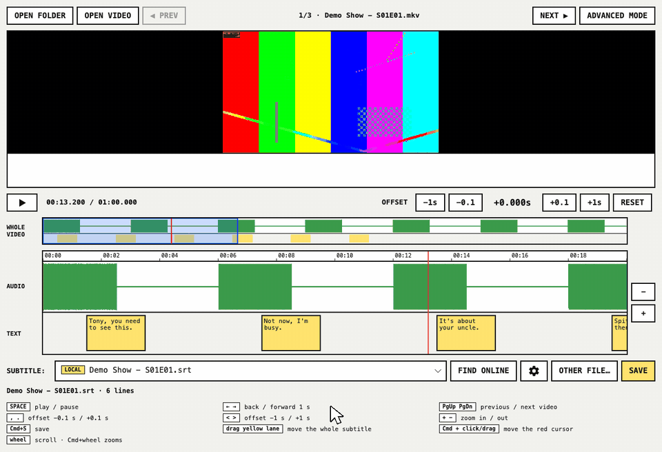
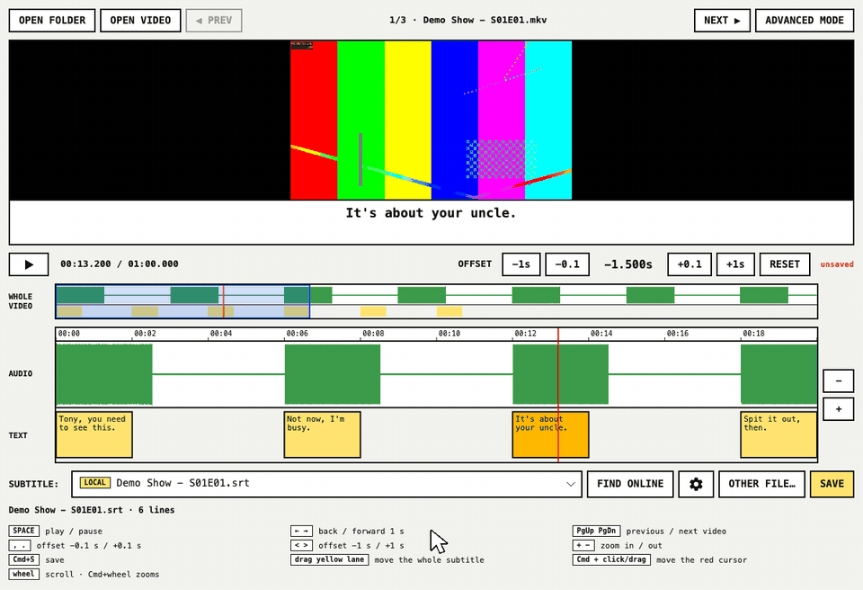

# Simple Subtitle Edit

**Fix out-of-sync subtitles in a few clicks, for good, on every screen.**

Plex lets you shift a subtitle's timing in the web player, but that fix stays in that browser:
the phone app, the TV and the console still show the subtitle early or late. Simple Subtitle
Edit fixes the subtitle itself, the file next to the video or the track inside it, so every
player gets it right.



[Leia em português](#português)

---

## How it works

### 1. Line the subtitle up with the speech

Open a video. The green blocks are the speech in the audio; the yellow blocks are the subtitle
lines. When they don't line up, **drag the yellow lane** until they do, or use **−1s −0.1 +0.1 +1s**.
Press play to check: the current line shows under the video.

The **WHOLE VIDEO** bar shows the entire episode: the yellow marks are where there is subtitle
text, the gaps are parts without any. Click anywhere on it to jump there.

### 2. Go through a whole series



Drop the series folder (season folders included) or click **OPEN FOLDER**. **NEXT ▶** and
**◀ PREV** walk the episodes in order, and each one brings its own subtitle. If you changed one
and didn't save, it asks before moving on.

### 3. Wrong subtitle? Find another one online



**FIND ONLINE** searches [OpenSubtitles.com](https://www.opensubtitles.com) for this exact video
file (by its hash) and by name, season and episode. Results are tagged **ONLINE**; the ones made
for your exact file say **✓ hash**. A subtitle is downloaded only when you pick it, and only once.

If a subtitle matches at the start but drifts apart later, it was made for another cut of the
episode: no offset will fix it. Pick another one.

### 4. Save it inside the video, and Plex picks it up



**SAVE** asks where:

- **Next to the video**: a `.srt` with the video's name, which every player and Plex find.
- **Inside the video** (mkv): a subtitle track in the language you choose, e.g. "Português
  (Brasil)". It replaces the previous track in that language and keeps the others. You'll see
  what is already inside before saving. Next time, the track shows up tagged **IN VIDEO** and
  you edit it the same way.

Then Plex is told to reload the video, so the new subtitle is on the TV a few seconds later.

---

## Install

> No ready-made downloads yet; until there are, run it from source (below).

The app needs three free programs:

| | macOS ([Homebrew](https://brew.sh)) | Ubuntu / Debian | Windows |
|---|---|---|---|
| **mpv**: plays the video | `brew install mpv` | `sudo apt install libmpv2` | offered on first start |
| **ffmpeg**: reads the audio | `brew install ffmpeg` | `sudo apt install ffmpeg` | `winget install ffmpeg` |
| **MKVToolNix**: saves inside mkv | `brew install mkvtoolnix` | `sudo apt install mkvtoolnix` | `winget install MKVToolNix.MKVToolNix` |

Then, with the [.NET 10 SDK](https://dotnet.microsoft.com/download):

```bash
git clone https://github.com/kevinkirsten/simple-subtitle-edit.git
cd simple-subtitle-edit
dotnet run --project src/ui/UI.csproj -c Release
```

To open a video or a folder directly: `dotnet run --project src/ui/UI.csproj -c Release -- "/path/to/video.mkv"`.

## Keyboard and mouse

| | |
|---|---|
| `Space` | play / pause |
| `←` `→` | back / forward 1 second |
| `PgUp` `PgDn` | previous / next video |
| `,` `.` | offset −0.1 s / +0.1 s |
| `<` `>` | offset −1 s / +1 s |
| `+` `−` | zoom in / out |
| `Cmd+S` / `Ctrl+S` | save |
| drag the yellow lane | move the whole subtitle |
| `Cmd` / `Ctrl` + click or drag on the timeline | move the red playback cursor |
| mouse wheel on the timeline | scroll; with `Cmd` / `Ctrl`, zoom |

## Settings (⚙)

- **OpenSubtitles.com**: needs a free account and an API key (Profile › API consumers).
  Searching uses only the key; downloading uses your login and counts against your daily limit.
- **Plex**: **SIGN IN WITH PLEX** works with any server (this computer, a NAS, Docker): approve
  it in the browser and your server is picked. **DETECT** finds a Plex on this computer. Videos
  are matched by folder and file name, so it works when Plex sees them under a different path.
  Without Plex, everything else works the same.

Your keys and logins are stored only on your computer.

## Advanced mode

Everything from Subtitle Edit is still here: editing text, OCR of image subtitles (PGS/VobSub),
speech-to-text, translation, 300+ formats. Click **ADVANCED MODE**, or start with `--advanced`;
**◀ Simple mode** in the editor brings you back.

## For developers

```bash
dotnet test tests/libuilogic/LibUiLogicTests.csproj --filter "FullyQualifiedName~SimpleSync"   # logic
dotnet test tests/UI/UITests.csproj --filter "FullyQualifiedName~Features.Simple"            # end to end, headless
./scripts/make-screenshots.sh   # docs/images/simple/*.png
./scripts/make-gifs.sh          # docs/images/simple/*.gif
```

| Where | What |
|---|---|
| `src/libuilogic/SimpleSync/` | No UI: finding and loading subtitles, offset, saving, mkv tracks (mkvmerge), OpenSubtitles, Plex |
| `src/ui/Features/Simple/` | The simple window, timeline, overview bar, dialogs |
| `src/ui/Program.cs` | Starts the simple window; `--advanced` starts the full editor |

The end-to-end tests drive a real window with real mouse and keyboard input through Avalonia's
headless platform; only the video player, OpenSubtitles and Plex are replaced by fakes. The GIFs
are recorded the same way, from demo clips made with ffmpeg.

## Credits and license

A fork of [Subtitle Edit](https://github.com/SubtitleEdit/subtitleedit) by Nikolaj Olsson and
contributors: the video player, the waveform engine and the subtitle formats are theirs. This
fork adds the simple window on top. MIT License, see [LICENSE](LICENSE). The original README is
in [README.upstream.md](README.upstream.md).

---

## Português

**Conserte legendas fora de sincronia em poucos cliques, de vez, em todas as telas.**

O Plex deixa ajustar o tempo da legenda no player do navegador, mas esse ajuste fica só ali: o
app do celular, a TV e o console continuam mostrando a legenda adiantada ou atrasada. O Simple
Subtitle Edit corrige a própria legenda, o arquivo ao lado do vídeo ou a faixa dentro dele, e
aí todo player acerta.


### 1. Encaixe a legenda nas falas

Abra um vídeo. Os blocos verdes são as falas do áudio; os amarelos, as falas da legenda. Se não
estiverem alinhados, **arraste a faixa amarela** até encaixar, ou use **−1s −0.1 +0.1 +1s**. Dê
play para conferir: a fala atual aparece embaixo do vídeo. A barra **VÍDEO INTEIRO** mostra o
episódio todo: o amarelo é onde há legenda e os buracos são trechos sem ela.

### 2. Passe pela série inteira


Arraste a pasta da série (com as temporadas) ou clique em **ABRIR PASTA**. **PRÓXIMO ▶** e
**◀ ANTERIOR** passam pelos episódios em ordem, e cada um traz a sua legenda. Se você mexeu e
não salvou, ele pergunta antes de trocar.

### 3. Legenda errada? Busque outra online


**BUSCAR ONLINE** procura no OpenSubtitles.com pelo arquivo exato (hash) e pelo nome, temporada
e episódio. Os resultados aparecem como **ONLINE**; os feitos para o seu arquivo exato mostram
**✓ hash**. A legenda só é baixada quando você escolhe, e uma vez só. Se encaixa no começo e
desencaixa depois, ela é de outra versão do episódio: troque por outra.

### 4. Salve dentro do vídeo, e o Plex recarrega


**SALVAR** pergunta onde: **ao lado do vídeo** (um `.srt` com o nome do vídeo) ou **dentro do
vídeo** (mkv), como faixa de legenda no idioma que você escolher, por exemplo "Português
(Brasil)". Ele mostra antes o que já existe dentro, troca a faixa anterior desse idioma e mantém
as outras. Da próxima vez, a faixa aparece como **NO VÍDEO** e você edita igual. Depois, o Plex é
avisado e a legenda nova aparece na TV em segundos.

### Instalar

Ainda não há instalador pronto. Instale o **mpv**, o **ffmpeg** e o **MKVToolNix** (tabela em
[Install](#install)) e o [.NET 10 SDK](https://dotnet.microsoft.com/download), e rode:

```bash
git clone https://github.com/kevinkirsten/simple-subtitle-edit.git
cd simple-subtitle-edit
dotnet run --project src/ui/UI.csproj -c Release
```

A interface aparece em português quando o sistema está em português. Atalhos e configurações
(⚙: OpenSubtitles e Plex) estão nas seções em inglês acima.
